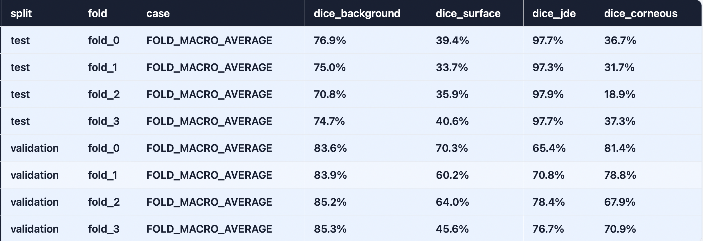
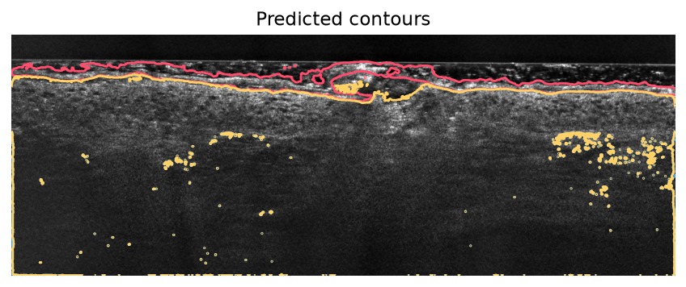
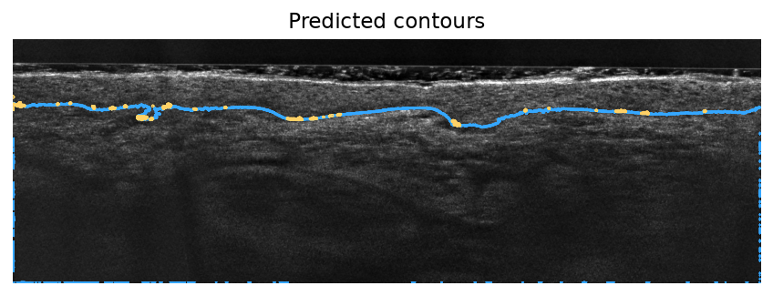

# SkinSeg Technical Test

An nnU-Net pipeline for segmenting retinal skin-layer structures in LC-OCT images. The project prepares the dataset, plans and preprocesses it with nnU-Net, trains cross-validation folds, predicts the test set, and generates a Dice scorecard with an HTML dashboard.

## Dataset

The segmentation labels are:

| Label | Class |
| ---: | --- |
| 0 | Background |
| 1 | Surface |
| 2 | JDE |
| 3 | Corneous |
| 4 | Ignore |

The nnU-Net folders are configured through:

```bash
export nnUNet_raw=/workspace/nnunet_data/nnunet_raw
export nnUNet_preprocessed=/workspace/nnunet_data/nnunet_preprocessed
export nnUNet_results=/workspace/nnunet_data/nnunet_results
```

## Installation

### Conda

```bash
source /workspace/miniconda3/etc/profile.d/conda.sh
conda activate skinseg_env
python --version
```

Install the project and local nnU-Net package:

```bash
cd /workspace/skinseg_technical_test
python -m pip install -e .
python -m pip install -e ./nnUNet
```

### Docker

Docker requires a running Docker daemon and, for GPU execution, NVIDIA Container Toolkit support on the host:

```bash
docker compose build
docker compose run --rm skinseg
```

To bind the persistent workspace dataset explicitly:

```bash
docker compose run --rm \
	-v /workspace/nnunet_data:/workspace/nnunet_data \
	skinseg
```

## Running the pipeline

The launcher uses these defaults:

| Variable | Default | Description |
| --- | --- | --- |
| `DATASET_ID` | `1` | nnU-Net dataset identifier |
| `CONFIGURATION` | `2d` | nnU-Net configuration |
| `FOLDS` | `0 1 2 3` | Folds to train or predict |
| `NNUNET_NUM_SPLITS` | `4` | Cross-validation splits |
| `TRAINER` | `nnUNetTrainer_60epochs` | Trainer class |
| `DEVICE` | `cuda` | `cuda` or `cpu` |

Run natively:

```bash
cd /workspace/skinseg_technical_test
source /workspace/miniconda3/etc/profile.d/conda.sh
conda activate skinseg_env
bash ./scripts/launch.sh
```

Run selected folds or CPU inference:

```bash
FOLDS="0 1" bash ./scripts/launch.sh
DEVICE=cpu bash ./scripts/launch.sh
```

The launcher runs dataset preparation, preprocessing, training, test prediction, and scorecard generation. The preparation and preprocessing commands can be enabled in `scripts/launch.sh` when the raw dataset needs to be rebuilt.

## Metrics and dashboard

Generate a scorecard for an existing model:

```bash
python src/skinseg_technical_test/nnunetv2/evaluation/metrics.py \
	--model-dir /workspace/nnunet_data/nnunet_results/Dataset001_SkinSegmentation/nnUNetTrainer_60epochs__nnUNetPlans__2d
```

The CSV uses shared columns for validation and test rows:

```text
split, fold, case, dice_background, dice_surface, dice_jde, dice_corneous
```

Unannotated labels produce `NaN` Dice values and are ignored in fold averages. The HTML dashboard embeds predicted contours over the source image, with a different color for each foreground label and no ground-truth contour.

Outputs are written beside the model:

```text
validation_scorecard.csv
validation_scorecard.html
scorecard_overlays/*.png
```

## Results

These results come from the four-fold `nnUNetTrainer_60epochs__nnUNetPlans__2d` run. Values are fold macro averages of per-case Dice scores.

### Validation

| Fold | Background | Surface | JDE | Corneous |
| --- | ---: | ---: | ---: | ---: |
| 0 | 83.6% | 70.3% | 65.4% | 81.4% |
| 1 | 83.9% | 60.2% | 70.8% | 78.8% |
| 2 | 85.2% | 64.0% | 78.4% | 67.9% |
| 3 | 85.3% | 45.6% | 76.7% | 70.9% |

### Test

| Fold | Background | Surface | JDE | Corneous |
| --- | ---: | ---: | ---: | ---: |
| 0 | 76.9% | 39.4% | 97.7% | 36.7% |
| 1 | 75.0% | 33.7% | 97.3% | 31.7% |
| 2 | 70.8% | 35.9% | 97.9% | 18.9% |
| 3 | 74.7% | 40.6% | 97.7% | 37.3% |

The model shows strong and stable JDE performance on the test set, while surface and corneous segmentation are substantially harder and show a clear validation-to-test gap. This suggests that the model learns the main layer geometry but remains sensitive to acquisition variability and thin or weakly contrasted boundaries. 

Also, is there seems to be a problem with the chosen solution, the missing labels seems to have an impact on the training, which was supposed to be dealt with with the nnUNet "ignore" label. There is a bias towards producing incomplete masks.

### Qualitative predictions



Examples below show predicted contours over LC-OCT images. Colors identify predicted foreground labels.





## Repository layout

```text
scripts/                 Pipeline entry points
src/                     Project Python package
nnUNet/                  Local nnU-Net source
data/                    Input data and masks
assets/                  README figures and prediction examples
nnunet_data/             Raw, preprocessed, and result directories
```
